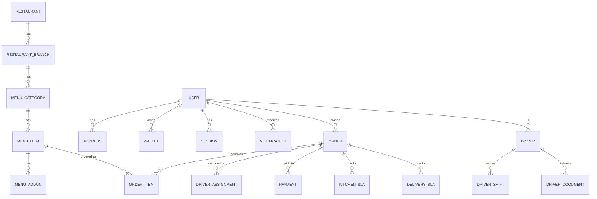

# Database

SpiceGarden uses polyglot persistence with three data stores:

- **PostgreSQL 16** — Relational data (TypeORM 1.0.0)
- **MongoDB 7** — Document data (Mongoose 9.7.0)
- **Redis 7** — Caching and job queues (BullMQ 5.78.1, ioredis 5.10.1)

---

## PostgreSQL Schema

### Custom Types (Enums)

| Enum | Values | Usage |
|------|--------|-------|
| `user_role` | `customer`, `restaurant`, `kitchen_staff`, `delivery_partner`, `admin`, `super_admin`, `support_staff`, `finance_staff` | `users.role` |
| `user_status` | `active`, `inactive`, `suspended` | `users.status` |
| `order_status` | `pending`, `confirmed`, `preparing`, `ready`, `assigned`, `picked_up`, `delivered`, `cancelled` | `orders.status` |
| `payment_status` | `pending`, `completed`, `failed`, `refunded` | `payments.status` |
| `payment_method_type` | `card`, `bank_account`, `wallet`, `upi` | `payment_methods.type` |
| `driver_kyc_status` | `pending`, `approved`, `rejected` | `drivers.kyc_status` |
| `driver_document_type` | `license`, `aadhar`, `pan`, `vehicle_rc`, `insurance` | `driver_documents.type` |

### Tables

| Table | Primary Key | Foreign Keys | Description |
|-------|-------------|--------------|-------------|
| `users` | `id UUID` | — | Core user accounts |
| `user_devices` | `id UUID` | `user_id` | Registered devices per user |
| `sessions` | `id UUID` | `user_id` | Active user sessions |
| `restaurants` | `id UUID` | — | Restaurant profiles |
| `restaurant_branches` | `id UUID` | `restaurant_id` | Restaurant branch locations |
| `branch_controls` | `id UUID` | `branch_id` | Branch operational controls |
| `restaurant_onboardings` | `id UUID` | `restaurant_id` | Onboarding workflow state |
| `menu_categories` | `id UUID` | `branch_id` | Menu categories per branch |
| `menu_items` | `id UUID` | `category_id` | Menu items |
| `menu_addons` | `id UUID` | `menu_item_id` | Item addons/customizations |
| `menu_variants` | `id UUID` | `menu_item_id` | Item variants (size, etc.) |
| `menu_item_availabilities` | `id UUID` | `menu_item_id` | Daily availability tracking |
| `menu_moderations` | `id UUID` | `menu_item_id` | Menu moderation queue |
| `orders` | `id UUID` | `user_id`, `restaurant_id` | Order headers |
| `order_items` | `id UUID` | `order_id` | Order line items |
| `addresses` | `id UUID` | `user_id` | User delivery addresses |
| `subscriptions` | `id UUID` | `user_id` | User subscriptions |
| `payment_methods` | `id UUID` | `user_id` | Saved payment methods |
| `payment_webhooks` | `id UUID` | — | Webhook event logs |
| `payment_disputes` | `id UUID` | — | Payment dispute records |
| `stripe_webhooks` | `id UUID` | — | Stripe-specific webhook logs |
| `webhook_retry_queue` | `id UUID` | `webhook_id` | Retry queue for failed webhooks |
| `coupons` | `id UUID` | — | Coupon definitions |
| `coupon_usages` | `id UUID` | `coupon_id`, `user_id`, `order_id` | Coupon redemption tracking |
| `referrals` | `id UUID` | `referrer_id`, `referee_id` | Referral program records |
| `wallets` | `id UUID` | `user_id` | User wallet balances |
| `wallet_transactions` | `id UUID` | `wallet_id` | Wallet transaction history |
| `ledger_entries` | `id UUID` | `wallet_id` | Double-entry ledger records |
| `drivers` | `id UUID` | `user_id` | Driver profiles |
| `driver_assignments` | `id UUID` | `order_id`, `driver_id` | Order-to-driver assignments |
| `driver_shifts` | `id UUID` | `driver_id` | Shift records |
| `driver_documents` | `id UUID` | `driver_id` | KYC document records |
| `driver_fraud` | `id UUID` | `driver_id` | Fraud incident records |
| `driver_scores` | `id UUID` | `driver_id` | Performance scores |
| `driver_incentives` | `id UUID` | `driver_id` | Incentive records |
| `driver_penalties` | `id UUID` | `driver_id` | Penalty records |
| `otps` | `id UUID` | — | OTP records for auth |
| `notifications` | `id UUID` | `user_id` | Notification records |
| `notification_preferences` | `id UUID` | `user_id` | User notification settings |
| `notification_analytics` | `id UUID` | `notification_id` | Notification engagement metrics |
| `gst_details` | `id UUID` | `restaurant_id` | GST registration details |
| `restaurant_gst` | `id UUID` | `restaurant_id` | Restaurant GST configuration |
| `hsn_sac` | `id UUID` | — | HSN/SAC code master data |
| `tax_reporting` | `id UUID` | — | Tax report records |
| `reconciliation` | `id UUID` | — | Payment reconciliation records |
| `support_tickets` | `id UUID` | `customer_id`, `order_id` | Support ticket records |
| `refunds` | `id UUID` | `order_id`, `user_id` | Refund records |
| `refund_approvals` | `id UUID` | `refund_id` | Refund approval workflow |
| `payout_reports` | `id UUID` | `restaurant_id` | Payout report records |
| `commission_rules` | `id UUID` | `restaurant_id` | Commission configuration |
| `recipes` | `id UUID` | `menu_item_id` | Recipe/BOM data |
| `inventory_items` | `id UUID` | `restaurant_id` | Inventory stock records |
| `inventory_alerts` | `id UUID` | `inventory_item_id` | Low-stock alerts |
| `suppliers` | `id UUID` | — | Supplier master data |
| `batches` | `id UUID` | `inventory_item_id` | Batch/lot tracking with expiry |
| `food_preps` | `id UUID` | `order_item_id` | Kitchen prep tracking |
| `kitchen_sla` | `id UUID` | `order_id`, `branch_id` | Kitchen SLA metrics |
| `delivery_sla` | `id UUID` | `order_id`, `driver_id` | Delivery SLA metrics |
| `sla_alerts` | `id UUID` | — | SLA violation alerts |
| `surge_zones` | `id UUID` | — | Surge pricing zones |
| `audit_logs` | `id UUID` | `user_id` | Audit trail records |
| `device_fingerprints` | `id UUID` | `user_id` | Device fingerprinting |
| `deletion_requests` | `id UUID` | `user_id` | GDPR/DPDP deletion requests |
| `data_export_requests` | `id UUID` | `user_id` | Data export requests |
| `holiday_schedules` | `id UUID` | — | Holiday schedule master |

### Key Relationships



### Indexes

Production indexes defined in:
- `infra/postgres/migrations/InitialSchema20240101000001__up.sql` (initial schema indexes)
- `apps/backend/src/db/migrations/AddProductionIndexes202406280001.ts` (performance indexes)

Common index patterns:
- Foreign key columns: `user_id`, `restaurant_id`, `order_id`, `driver_id`, `branch_id`
- Composite indexes for common query patterns
- UUID primary keys on all tables
- Timestamp columns (`created_at`, `updated_at`) for audit and sorting

---

## MongoDB Collections

MongoDB is used for document-heavy data that benefits from flexible schemas.

| Collection | Purpose |
|-----------|---------|
| `notifications` | Notification payloads with complex data structures |
| `notification_analytics` | Engagement tracking (open/click events) |
| `payment_webhooks` | Raw webhook payload storage |
| `audit_logs` | Detailed audit event documents |

### Mongoose Models

| Model | Schema Key Features |
|-------|-------------------|
| `Notification` | userId, type, title, body, data, status, timestamps |
| `NotificationAnalytics` | notificationId, openedAt, clickedAt |
| `PaymentWebhook` | gateway, eventType, payload, processed, timestamps |

---

## Redis Usage

### Caching

- **Library:** `ioredis` 5.10.1
- **Pool Size:** Configurable via `DB_POOL_SIZE` (default: 20)
- **Usage:** Session data, rate limiting state, hot data caching

### BullMQ Queues

| Queue | Processor | Purpose |
|-------|-----------|---------|
| Default Queue | `QueueService` | General async job processing |
| Order Queue | `OrderProcessor` | Order lifecycle events |
| Notification Queue | `NotificationQueueService` | Queued notification dispatch |
| Webhook Retry Queue | `WebhookRetryService` | Failed webhook retries |

### Queue Configuration

```typescript
{
  connection: Redis,
  defaultJobOptions: {
    attempts: 3,
    backoff: { type: 'exponential', delay: 1000 },
    removeOnComplete: { count: 100 },
    removeOnFail: { count: 50 },
  }
}
```

### Rate Limiting Store

- **Class:** `RedisRateLimitStore`
- **Prefix:** `spicegarden:ratelimit`
- **Fallback:** Memory store when Redis unavailable (dev only)

---

## Migrations

### TypeORM Migrations

| Migration | Location | Type |
|-----------|----------|------|
| `InitialSchema20240101000001` | `apps/backend/src/db/migrations/` | SQL (1029 lines, 60+ tables) |
| `AddProductionIndexes202406280001` | `apps/backend/src/db/migrations/` | TypeScript |

### Raw SQL Migrations

| Migration | Location | Purpose |
|-----------|----------|---------|
| `InitialSchema20240101000001__up.sql` | `infra/postgres/migrations/` | Initial schema creation |
| `InitialSchema20240101000001__down.sql` | `infra/postgres/migrations/` | Schema rollback |

### Seed Data

| Seed File | Location | Purpose |
|-----------|----------|---------|
| `001_restaurants_branches_menus.sql` | `infra/postgres/seed/` | Sample restaurants, branches, menus |
| `002_test_users.sql` | `infra/postgres/seed/` | Test user accounts |

### Migration Commands

```bash
cd apps/backend

# Generate migration
npm run migration:generate -- -d src/db/data-source.ts

# Run pending migrations
npm run migration:run -- -d src/db/data-source.ts

# Revert last migration
npm run migration:revert -- -d src/db/data-source.ts

# Show migration status
npm run migration:show -- -d src/db/data-source.ts
```

---

## Connection Configuration

### Data Source (`src/db/data-source.ts`)

```typescript
{
  type: 'postgres',
  host: process.env.DB_HOST || 'localhost',
  port: parseInt(process.env.DB_PORT || '5432'),
  username: process.env.DB_USER || 'spicegarden',
  password: process.env.DB_PASS || 'spicegarden_dev',
  database: process.env.DB_NAME || 'spicegarden',
  entities,
  migrations: ['src/db/migrations/*.ts'],
  synchronize: false,        // Production uses migrations only
  migrationsRun: true,
  poolSize: parseInt(process.env.DB_POOL_SIZE || '20'),
  connectTimeoutMS: 5000,
  keepAlive: true,
}
```

### Environment Variables

| Variable | Default | Description |
|----------|---------|-------------|
| `DB_HOST` | `localhost` | PostgreSQL host |
| `DB_PORT` | `5432` | PostgreSQL port |
| `DB_USER` | `spicegarden` | PostgreSQL username |
| `DB_PASS` | `spicegarden_dev` | PostgreSQL password |
| `DB_NAME` | `spicegarden` | PostgreSQL database |
| `DB_POOL_SIZE` | `20` | Connection pool size |
| `MONGO_URI` | `mongodb://mongo:27017/spicegarden` | MongoDB connection string |
| `REDIS_HOST` | `redis` | Redis host |
| `REDIS_PORT` | `6379` | Redis port |
| `REDIS_PASSWORD` | — | Redis password (optional) |

---

## Full Entity Inventory (66 Entities)

1. UserEntity
2. UserDeviceEntity
3. UserSessionEntity
4. RestaurantEntity
5. RestaurantBranchEntity
6. BranchControlEntity
7. RestaurantOnboardingEntity
8. MenuCategoryEntity
9. MenuItemEntity
10. MenuAddonEntity
11. MenuVariantEntity
12. MenuItemAvailabilityEntity
13. MenuModerationEntity
14. OrderEntity
15. OrderItemEntity
16. AddressEntity
17. SubscriptionEntity
18. PaymentMethodEntity
19. PaymentWebhookEntity
20. PaymentDisputeEntity
21. StripeWebhookEntity
22. WebhookRetryQueueEntity
23. CouponEntity
24. CouponUsageEntity
25. ReferralEntity
26. WalletEntity
27. WalletTransactionEntity
28. LedgerEntryEntity
29. DriverEntity
30. DriverAssignmentEntity
31. DriverShiftEntity
32. DriverDocumentEntity
33. DriverFraudEntity
34. DriverScoreEntity
35. DriverIncentiveEntity
36. DriverPenaltyEntity
37. OtpEntity
38. NotificationEntity
39. NotificationPreferenceEntity
40. NotificationAnalyticsEntity
41. GSTDetailEntity
42. RestaurantGSTEntity
43. HsnSacEntity
44. SupportTicketEntity
45. RefundEntity
46. RefundApprovalEntity
47. PayoutReportEntity
48. CommissionRuleEntity
49. RecipeEntity
50. InventoryItemEntity
51. InventoryAlertEntity
52. SupplierEntity
53. BatchEntity
54. FoodPrepEntity
55. KitchenSlaEntity
56. DeliverySlaEntity
57. SlaAlertEntity
58. SurgeZoneEntity
59. AuditLogEntity
60. DeviceFingerprintEntity
61. DeletionRequestEntity
62. DataExportRequestEntity
63. HolidayScheduleEntity
64. DisputeEntity
65. SessionEntity
66. OtpEntity
