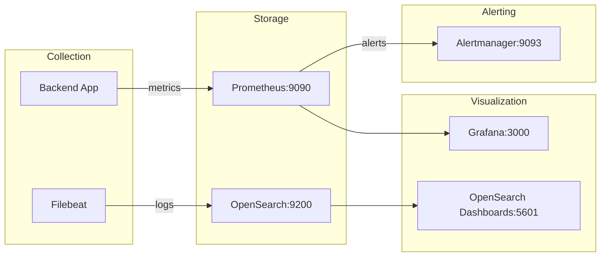

# DevOps

## CI/CD Pipeline

### GitHub Actions Workflows

| Workflow | File | Trigger | Purpose |
|----------|------|---------|---------|
| CI/CD | `.github/workflows/ci-cd.yml` | Push, PR | Build, lint, test, deploy |
| React Doctor | `.github/workflows/react-doctor.yml` | Push, PR | Frontend quality checks |
| Rollback | `.github/workflows/rollback.yml` | Manual | Automated rollback |

### Pipeline Stages

1. **Checkout** — Repository checkout
2. **Install** — `npm ci` for deterministic installs
3. **Lint** — `npm run lint` across all workspaces
4. **Type Check** — TypeScript compilation
5. **Test** — Unit, integration, e2e tests
6. **Build** — `npm run build` for all packages
7. **Security Scan** — Dependency audit, security tests
8. **Docker Build** — Multi-stage image builds
9. **Deploy** — Environment-specific deployment

---

## Secrets Management

### Production Secrets

Production secrets are managed via Docker secrets and loaded by `SecretLoaderService`:

| Secret | File | Purpose |
|--------|------|---------|
| `db_pass` | `secrets/db_password.txt` | PostgreSQL password |
| `jwt_secret` | `secrets/jwt_secret.txt` | JWT signing key |
| `encryption_secret` | `secrets/encryption_secret.txt` | AES encryption key |
| `fcm_server_key` | `secrets/fcm_server_key.txt` | Firebase Cloud Messaging |
| `apns_private_key` | `secrets/apns_private_key.txt` | Apple Push Notification key |
| `smtp_pass` | `secrets/sendgrid_api_key.txt` | SendGrid API key |
| `twilio_account_sid` | `secrets/twilio_account_sid.txt` | Twilio account SID |
| `twilio_auth_token` | `secrets/twilio_auth_token.txt` | Twilio auth token |
| `google_maps_api_key` | `secrets/google_maps_api_key.txt` | Google Maps API key |
| `mongo_password` | `secrets/mongo_password.txt` | MongoDB password |

### Secret Loading

- **Development:** Environment variables from `.env`
- **Production:** Docker secrets mounted as files, loaded by `SecretLoaderService`
- **Rotation:** `SecretsRotationService` in compliance module handles automatic rotation
- **Validation:** `requireSecrets()` in `main.ts` validates all required secrets are present in production

### Kubernetes Secrets

```yaml
kubectl apply -f infra/k8s/secrets.yaml
kubectl apply -f infra/k8s/configmap.yaml
```

---

## Monitoring

### Access Points

| Service | Port | URL | Credentials |
|---------|------|-----|-------------|
| Prometheus | 9090 | http://localhost:9090 | — |
| Grafana | 3000 | http://localhost:3000 | admin / admin |
| Alertmanager | 9093 | http://localhost:9093 | — |
| OpenSearch | 9200 | http://localhost:9200 | admin / Opensearch#2026! |
| OpenSearch Dashboards | 5601 | http://localhost:5601 | — |

### Observability Stack



### Metrics

- **Endpoint:** `/metrics` (Prometheus exposition format)
- **Libraries:** `prom-client` Counter + Histogram
- **Default Metrics:** Node.js runtime metrics collected automatically
- **Custom Metrics:**
  - `http_requests_total` — HTTP request count by method, route, status
  - `http_request_duration_seconds` — HTTP request duration histogram

### Dashboards

Pre-configured Grafana dashboards in `infra/grafana/dashboards/`:
- Backend performance dashboard
- Order processing metrics
- Payment success/failure rates
- Delivery performance
- Database query performance

### Alert Rules

Alertmanager rules in `infra/prometheus/rules/`:
- High error rate alerts
- Slow response time alerts
- Database connection failures
- Queue depth warnings
- Payment failure spikes

---

## Logging

### Architecture

- **Structured logging** via `LoggingService` and `LoggerService`
- **Log aggregation:** OpenSearch for centralized log storage
- **Log shipping:** Filebeat for log collection and forwarding
- **Log rotation:** Configured via Docker logging driver (max-size: 10m, max-file: 3)

### Log Levels

| Level | Usage |
|-------|-------|
| ERROR | Application errors, exceptions |
| WARN | Warnings, recoverable issues |
| INFO | Business events, request logging |
| DEBUG | Detailed debugging (non-production) |

---

## Health Checks

### Application Health

| Check | Endpoint | Implementation |
|-------|----------|---------------|
| HTTP Health | `GET /health` | Returns 200 with timestamp |
| HTTP Health | `GET /orders/health` | Order service health |
| Metrics | `GET /metrics` | Prometheus metrics |

### Docker Health Checks

```yaml
# Backend
test: ["CMD", "node", "-e", "require('http').get('http://127.0.0.1:3001/health', ...)"]

# Frontends
test: ["CMD", "curl", "-f", "http://localhost:3000/"]

# Infrastructure
postgres: pg_isready
redis: redis-cli ping
mongo: mongosh --eval "db.adminCommand('ping')"
```

### Stack Verification

```bash
node infra/scripts/verify-stack.js
```

Validates all services are reachable and healthy.

---

## Scripts

### Infrastructure Scripts

| Script | Purpose |
|--------|---------|
| `infra/scripts/backup.sh` | Database backup |
| `infra/scripts/disaster-recovery.sh` | Disaster recovery procedures |
| `infra/scripts/verify-stack.js` | Stack health verification |
| `infra/scripts/security-tests.js` | Security vulnerability tests |
| `infra/scripts/penetration-tests.js` | Penetration tests |
| `infra/scripts/breaking-point.js` | Breaking point load tests |
| `infra/scripts/fake-orders.js` | Fake order generation for testing |
| `infra/scripts/chaos-runner.js` | Chaos engineering experiments |
| `infra/scripts/generate-secrets.ps1` | Secret generation (Windows) |
| `infra/scripts/validate-secrets.js` | Secret validation |
| `infra/scripts/deployment-check.js` | Deployment validation |
| `infra/scripts/autoscaling-validation.sh` | HPA validation |

### Load Test Scripts

| Script | Purpose |
|--------|---------|
| `infra/load-tests/stage-1-1k.js` | 1,000 VUs |
| `infra/load-tests/stage-2-5k.js` | 5,000 VUs |
| `infra/load-tests/stage-3-10k.js` | 10,000 VUs |
| `infra/load-tests/stage-4-20k.js` | 20,000 VUs |
| `infra/load-tests/stage-5-50k.js` | 50,000 VUs |
| `infra/load-tests/stage-6-100k.js` | 100,000 VUs |
| `infra/load-tests/stage-7-500k.js` | 500,000 VUs |
| `infra/load-tests/stage-8-1m.js` | 1,000,000 VUs |
| `infra/load-tests/websocket-stress.js` | WebSocket stress test |
| `infra/load-tests/database-stress.js` | Database stress test |
| `infra/load-tests/payment-stress.js` | Payment stress test |
| `infra/load-tests/failure-injection.js` | Failure injection test |
| `infra/load-tests/security-under-load.js` | Security under load |

---

## Backup and Recovery

### Backup Script

```bash
bash infra/scripts/backup.sh
```

Performs PostgreSQL database backup with timestamp.

### Disaster Recovery

```bash
bash infra/scripts/disaster-recovery.sh --production
```

Restores production from backup with validation steps.

---

## Deployment Commands

### Local Development

```bash
# Start all services
docker-compose -f compose.dev.yaml up -d

# Stop all services
docker-compose -f compose.dev.yaml down
```

### Production

```bash
# Staging
kubectl apply -f infra/k8s/staging.yaml -n spicegarden-staging

# Production
kubectl apply -f infra/k8s/production-hardened.yaml -n spicegarden-production
kubectl apply -f infra/k8s/cdn-ingress.yaml -n spicegarden-production
```

### Rollback

```bash
kubectl rollout undo deployment/backend -n spicegarden-production
kubectl rollout undo deployment/customer-web -n spicegarden-production
```

---

## Environment Configuration

### Files

| File | Purpose |
|------|---------|
| `.env.example` | Development template (96 variables) |
| `.env.staging.example` | Staging template |
| `.env.production.example` | Production template |
| `.env` | Local development (gitignored) |

### Key Variables

- **Application:** `NODE_ENV`, `PORT`, `SESSION_DURATION_DAYS`, `REFRESH_TOKEN_LENGTH`
- **Database:** `DB_HOST`, `DB_PORT`, `DB_USER`, `DB_PASS`, `DB_NAME`, `MONGO_URI`, `REDIS_HOST`, `REDIS_PORT`
- **Security:** `JWT_SECRET`, `ENCRYPTION_SECRET`, `CORS_ALLOWED_ORIGINS`
- **Payments:** `STRIPE_SECRET_KEY`, `STRIPE_WEBHOOK_SECRET`, `RAZORPAY_KEY_ID`, `RAZORPAY_KEY_SECRET`
- **Monitoring:** `SENTRY_DSN`, `METRICS_ENABLED`
- **Notifications:** `SMTP_HOST`, `SMTP_USER`, `SMTP_PASS`, `TWILIO_ACCOUNT_SID`, `TWILIO_AUTH_TOKEN`, `FCM_SERVER_KEY`
- **External APIs:** `GOOGLE_MAPS_API_KEY`, `SENDGRID_API_KEY`
