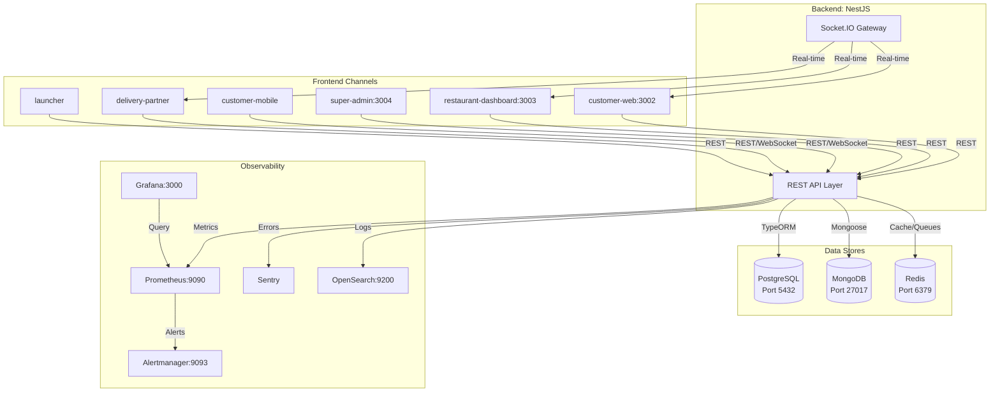
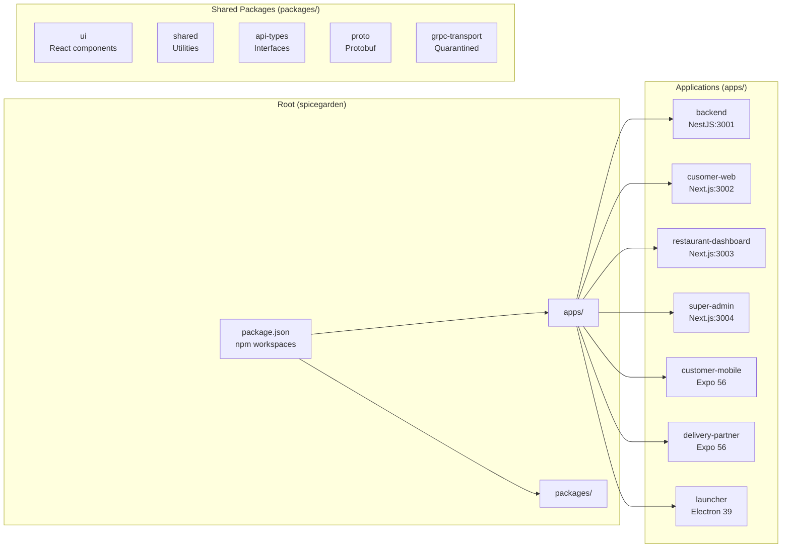
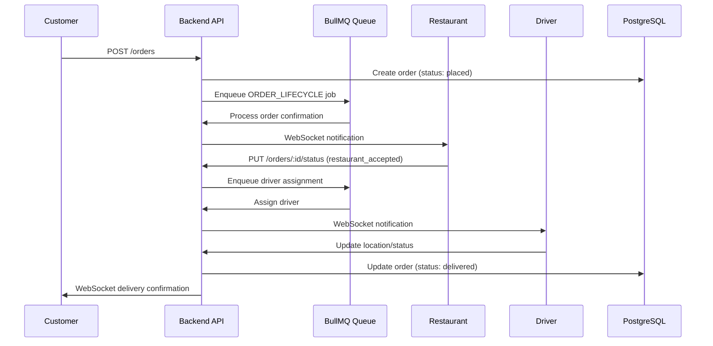
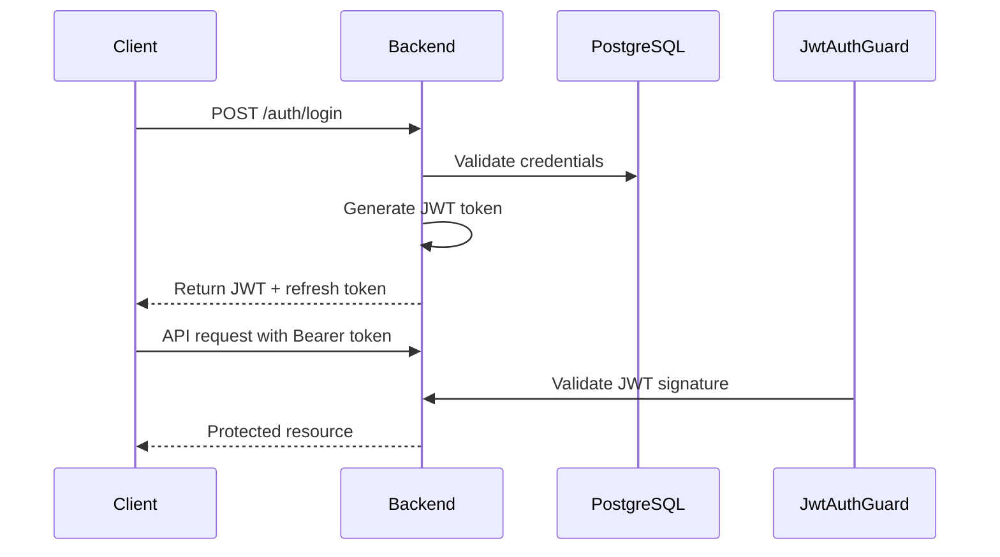
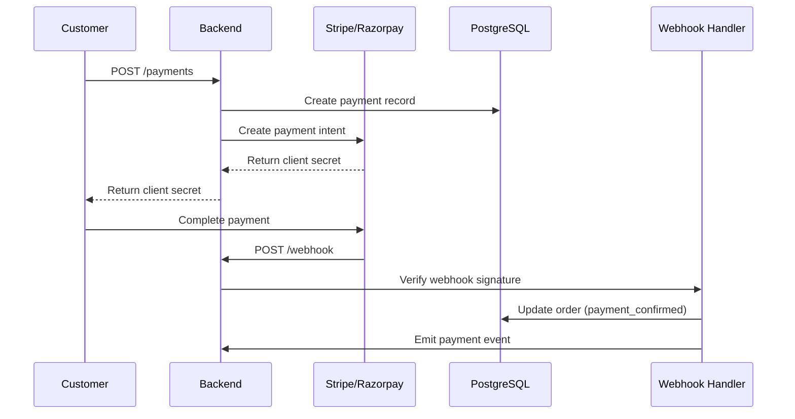
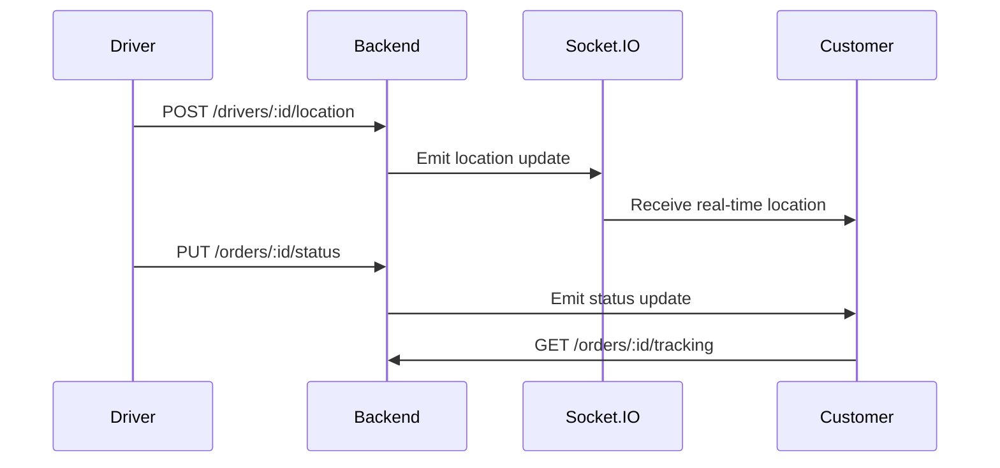
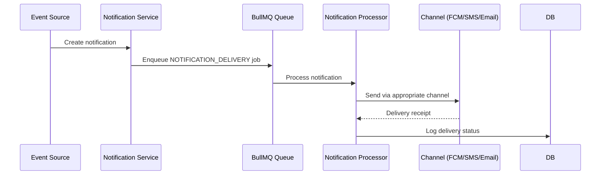
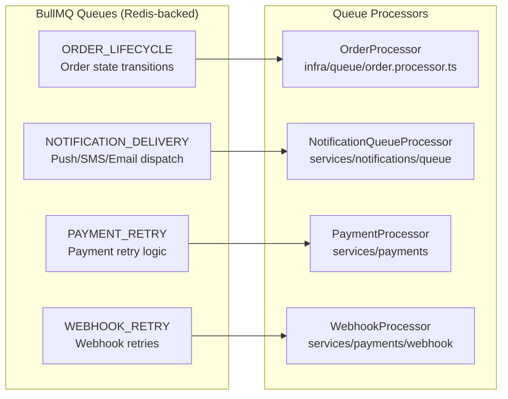
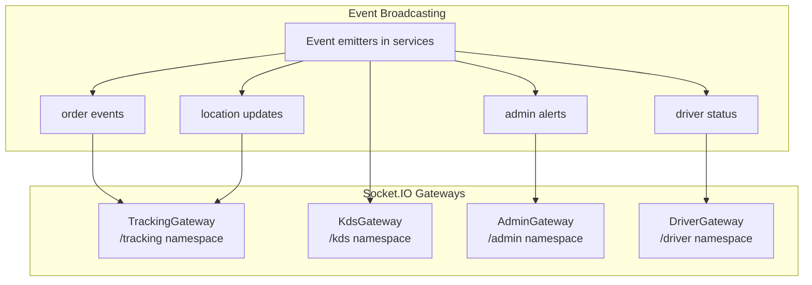

# System Architecture

## High-Level Architecture

SpiceGarden follows a modular monolith pattern with event-driven workflows. The backend exposes REST and WebSocket APIs consumed by multiple frontend channels.

### Service Interaction Diagram

## Monorepo Structure

## Data Flow

### Order Lifecycle

### Auth Flow

### Payment Flow

### Delivery Flow

### Notification Flow

## Queue Architecture (BullMQ)

## WebSocket Architecture (Socket.IO)

## Component Responsibilities

### Backend Modules

| Module | Responsibility | Key Services |
|--------|----------------|--------------|
| `AuthModule` | Authentication, JWT, OAuth2 | `auth.service.ts`, `password-reset.service.ts` |
| `OrderModule` | Order lifecycle management | `order.service.ts` |
| `PaymentModule` | Payments, refunds, chargebacks | `payments.service.ts`, `refund.service.ts` |
| `DeliveryModule` | Delivery orchestration | `delivery.service.ts`, `enhanced-delivery.service.ts` |
| `WalletModule` | Wallet operations | `wallet.service.ts` |
| `GSTModule` | Tax compliance | `gst.service.ts` |
| `NotificationModule` | Multi-channel notifications | `notification.service.ts`, `notification-preferences.service.ts` |
| `KitchenModule` | Kitchen operations, KDS | `kitchen.service.ts` |
| `DriverAssignmentModule` | Driver matching, dispatch | `driver-assignment.service.ts`, `dispatch-engine.service.ts` |
| `AdminModule` | Platform administration | `admin.service.ts` |
| `AnalyticsModule` | Metrics, reporting | `analytics.service.ts` |
| `ComplianceModule` | GDPR/DPDP, SOC2, PCI-DSS | `compliance.service.ts` |
| `AuditModule` | Audit logging | `audit.service.ts` |
| `ReviewModule` | Customer reviews | `review.service.ts` |
| `SupportModule` | Customer support | `customer-support.service.ts` |
| `SearchModule` | Restaurant/dish search | `search.service.ts` |
| `MapsModule` | Geocoding, routing | `maps.service.ts` |
| `FinanceModule` | Financial operations | `tax-reporting.service.ts`, `reconciliation.service.ts` |

### Infrastructure Components

| Component | Location | Purpose |
|-----------|----------|---------|
| `DbModule` | `apps/backend/src/db/` | TypeORM/Mongoose connection management |
| `QueueModule` | `apps/backend/src/infra/queue/` | BullMQ queue orchestration |
| `TrackingModule` | `apps/backend/src/infra/tracking/` | WebSocket gateway configuration |
| `SecurityModule` | `apps/backend/src/security/` | Guards, encryption, rate limiting |
| `MetricsModule` | `apps/backend/src/metrics/` | Prometheus metrics collection |
| `LoggingModule` | `apps/backend/src/logging/` | Structured logging |
| `SecretLoaderService` | `apps/backend/src/infra/` | Runtime secret injection |

### Frontend Applications

| App | Port | Purpose | Key Features |
|-----|------|---------|--------------|
| `customer-web` | 3002 | Customer storefront | Restaurant browsing, cart, checkout, order tracking |
| `restaurant-dashboard` | 3003 | Kitchen/KDS | Order management, inventory, real-time updates |
| `super-admin` | 3004 | Admin console | Analytics, driver fleet, support tickets |
| `customer-mobile` | Expo | Customer mobile | Navigation, location, push notifications |
| `delivery-partner` | Expo | Driver app | Location tracking, order status, earnings |
| `launcher` | Electron | Desktop | System monitoring, service control |