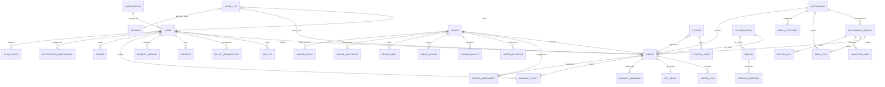

# Database Relations

```mermaid
erDiagram
    USER ||--o{ ORDER : "places"
    USER ||--o{ WALLLET : "owns"
    USER ||--o{ WALLET_TRANSACTION : "transactions"
    USER ||--o{ ADDRESS : "has"
    USER ||--o{ PAYMENT_METHOD : "methods"
    USER ||--o{ SUPPORT_TICKET : "creates"
    USER ||--o{ REVIEW : "writes"
    USER ||--o{ NOTIFICATION_PREFERENCE : "preferences"
    USER ||--o{ USER_DEVICE : "devices"
    
    RESTAURANT ||--o{ RESTAURANT_BRANCH : "has branches"
    RESTAURANT ||--o{ MENU_ITEM : "menus"
    RESTAURANT ||--o{ MENU_CATEGORY : "categories"
    RESTAURANT ||--o{ ORDER : "receives"
    
    RESTAURANT_BRANCH ||--o{ ORDER : "orders"
    RESTAURANT_BRANCH ||--o{ MENU_ITEM : "items"
    RESTAURANT_BRANCH ||--o{ INVENTORY_ITEM : "inventory"
    RESTAURANT_BRANCH ||--o{ KITCHEN_SLA : "sla"
    
    ORDER ||--o{ ORDER_ITEM : "contains"
    ORDER ||--|| GST_DETAIL : "gst_detail"
    ORDER ||--o{ PAYMENT_WEBHOOK : "webhooks"
    ORDER ||--o{ SUPPORT_TICKET : "tickets"
    ORDER ||--|| DRIVER_ASSIGNMENT : "assignment"
    
    DRIVER ||--o{ ORDER : "delivers"
    DRIVER ||--o{ DRIVER_ASSIGNMENT : "assignments"
    DRIVER ||--o{ DRIVER_INCENTIVE : "incentives"
    DRIVER ||--o{ DRIVER_PENALTY : "penalties"
    DRIVER ||--o{ DRIVER_SCORE : "scores"
    DRIVER ||--o{ DRIVER_SHIFT : "shifts"
    DRIVER ||--o{ DRIVER_DOCUMENT : "documents"
    DRIVER ||--o{ DRIVER_FRAUD : "fraud_records"
    
    COUPON ||--o{ COUPON_USAGE : "uses"
    COUPON }o--|| ORDER : "applied_to"
    
    REFUND ||--o{ REFUND_APPROVAL : "approvals"
    
    SUBSCRIPTION ||--o{ USER : "belongs_to"
    
    AUDIT_LOG }o--|| USER : "actor"
    AUDIT_LOG }o--|| ORDER : "order_event"
    AUDIT_LOG }o--|| PAYMENT : "payment_event"
    
    LEDGER_ENTRY ||--o{ ORDER : "for_order"
    LEDGER_ENTRY ||--o{ REFUND : "for_refund"
```