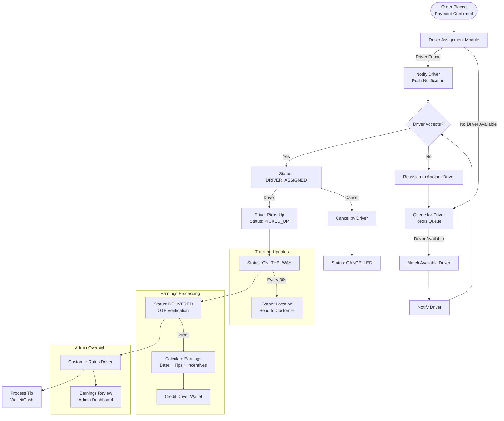

# Delivery Flow

```mermaid
flowchart TD
    OrderPlaced([Order Placed<br/>Payment Confirmed]) --> AssignDriver[Driver Assignment Module]
    
    AssignDriver -->|Driver Found| NotifyDriver[Notify Driver<br/>Push Notification]
    AssignDriver -->|No Driver Available| QueueForDriver[Queue for Driver<br/>Redis Queue]
    
    QueueForDriver -->|Driver Available| MatchDriver[Match Available Driver]
    MatchDriver --> NotifyMatched[Notify Driver]
    
    NotifyDriver --> DriverAccepts{Driver Accepts?}
    NotifyMatched --> DriverAccepts
    
    DriverAccepts -->|Yes| DriverAssigned[Status: DRIVER_ASSIGNED]
    DriverAccepts -->|No| Reassign[Reassign to Another Driver]
    
    Reassign --> QueueForDriver
    
    DriverAssigned -->|Driver| PickedUp[Driver Picks Up<br/>Status: PICKED_UP]
    DriverAssigned -->|Cancel| DriverCancel[Cancel by Driver]
    
    DriverCancel --> Cancelled[Status: CANCELLED]
    
    PickedUp --> OnTheWay[Status: ON_THE_WAY]
    OnTheWay --> Delivered[Status: DELIVERED<br/>OTP Verification]
    
    Delivered --> RateDriver[Customer Rates Driver]
    RateDriver --> TipProcess[Process Tip<br/>Wallet/Cash]
    
    subgraph Tracking Updates
        OnTheWay -->|Every 30s| LocationUpdate[Gather Location<br/>Send to Customer]
    end
    
    subgraph Earnings Processing
        Delivered -->|Driver| EarningsCalc[Calculate Earnings<br/>Base + Tips + Incentives]
        EarningsCalc --> WalletCredit[Credit Driver Wallet]
    end
    
    subgraph Admin Oversight
        RateDriver --> AdminReview[Earnings Review<br/>Admin Dashboard]
    end
```