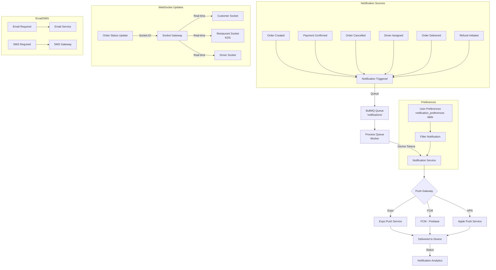

# Notification Flow

```mermaid
flowchart TD
    subgraph Notification Sources
        OrderCreated[Order Created] --> NotificationTriggered[Notification Triggered]
        PaymentConfirmed[Payment Confirmed] --> NotificationTriggered
        OrderCancelled[Order Cancelled] --> NotificationTriggered
        DriverAssigned[Driver Assigned] --> NotificationTriggered
        OrderDelivered[Order Delivered] --> NotificationTriggered
        RefundInitiated[Refund Initiated] --> NotificationTriggered
    end
    
    NotificationTriggered -->|Queue| NotificationQueue[BullMQ Queue<br/>`notifications`]
    NotificationQueue --> ProcessQueue[Process Queue<br/>Worker]
    
    ProcessQueue -->|Device Tokens| NotificationService[Notification Service]
    
    NotificationService --> PushGateway{Push Gateway}
    PushGateway -->|Expo| ExpoPush[Expo Push Service]
    PushGateway -->|FCM| FCMPush[FCM - Firebase]
    PushGateway -->|APN| APNPush[Apple Push Service]
    
    ExpoPush --> Delivered[Delivered to Device]
    FCMPush --> Delivered
    APNPush --> Delivered
    
    Delivered -->|Status| Analytics[Notification Analytics]
    
    subgraph Preferences
        UserPrefs[User Preferences<br/>notification_preferences table] --> FilterPrefs[Filter Notification]
        FilterPrefs --> NotificationService
    end
    
    subgraph WebSocket Updates
        OrderUpdate[Order Status Update] -->|Socket.IO| SocketGateway[Socket Gateway]
        SocketGateway -->|Real-time| CustomerSocket[Customer Socket]
        SocketGateway -->|Real-time| RestaurantSocket[Restaurant Socket<br/>KDS]
        SocketGateway -->|Real-time| DriverSocket[Driver Socket]
    end
    
    subgraph Email/SMS
        EmailNeeded[Email Required] --> EmailService[Email Service]
        SMSNeeded[SMS Required] --> SMSGateway[SMS Gateway]
    end
```