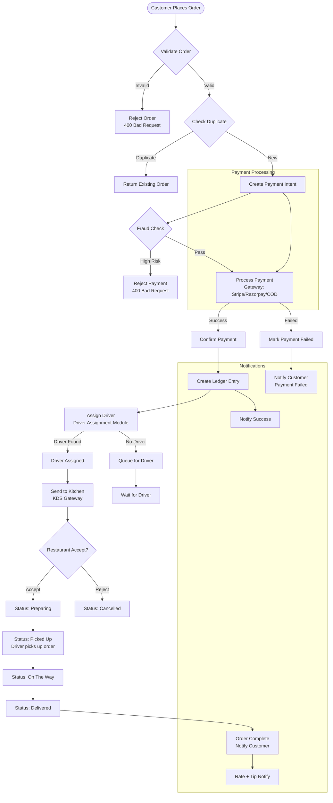

# Order Flow

```mermaid
flowchart TD
    Start([Customer Places Order]) --> Validate{Validate Order}
    Validate -->|Invalid| Reject[Reject Order<br/>400 Bad Request]
    Validate -->|Valid| CheckDuplicate{Check Duplicate}
    CheckDuplicate -->|Duplicate| ReturnExisting[Return Existing Order]
    CheckDuplicate -->|New| CreateIntent[Create Payment Intent]
    CreateIntent --> FraudCheck{Fraud Check}
    FraudCheck -->|High Risk| RejectPayment[Reject Payment<br/>400 Bad Request]
    FraudCheck -->|Pass| ProcessPayment[Process Payment<br/>Gateway: Stripe/Razorpay/COD]
    
    ProcessPayment -->|Success| ConfirmPayment[Confirm Payment]
    ProcessPayment -->|Failed| MarkFailed[Mark Payment Failed]
    ConfirmPayment --> CreateLedger[Create Ledger Entry]
    CreateLedger --> AssignDriver[Assign Driver<br/>Driver Assignment Module]
    MarkFailed --> NotifyFailed[Notify Customer<br/>Payment Failed]
    
    AssignDriver -->|Driver Found| DriverAssigned[Driver Assigned]
    AssignDriver -->|No Driver| Queue[Queue for Driver]
    DriverAssigned --> Kitchen[Send to Kitchen<br/>KDS Gateway]
    Queue --> Wait[Wait for Driver]
    
    Kitchen --> RestaurantAccept{Restaurant Accept?}
    RestaurantAccept -->|Accept| Preparing[Status: Preparing]
    RestaurantAccept -->|Reject| Cancelled[Status: Cancelled]
    
    Preparing --> PickedUp[Status: Picked Up<br/>Driver picks up order]
    PickedUp --> OnTheWay[Status: On The Way]
    OnTheWay --> Delivered[Status: Delivered]
    
    Delivered --> Complete[Order Complete<br/>Notify Customer]
    
    subgraph Payment Processing
        CreateIntent --> ProcessPayment
    end
    
    subgraph Notifications
        NotifyFailed
        CreateLedger --> NotifySuccess[Notify Success]
        Complete --> RateNotify[Rate + Tip Notify]
    end
```