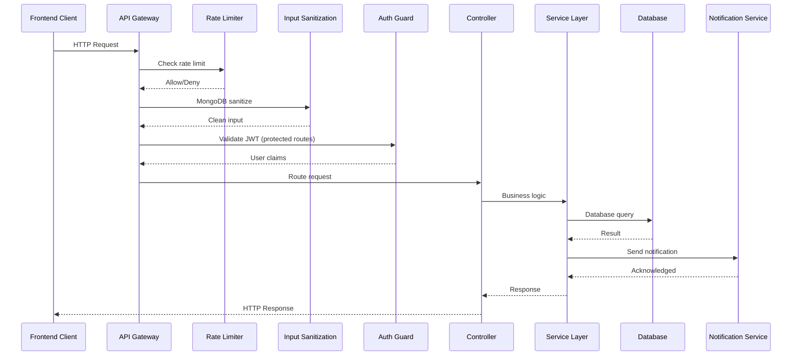

# Request Flow

```mermaid
sequenceDiagram
    participant Client as Frontend Client
    participant Gateway as API Gateway
    participant Rate as Rate Limiter
    participant Sanitize as Input Sanitization
    participant Auth as Auth Guard
    participant Controller as Controller
    participant Service as Service Layer
    participant DB as Database
    participant Notify as Notification Service

    Client->>Gateway: HTTP Request
    Gateway->>Rate: Check rate limit
    Rate-->>Gateway: Allow/Deny
    Gateway->>Sanitize: MongoDB sanitize
    Sanitize-->>Gateway: Clean input
    Gateway->>Auth: Validate JWT (protected routes)
    Auth-->>Gateway: User claims
    Gateway->>Controller: Route request
    Controller->>Service: Business logic
    Service->>DB: Database query
    DB-->>Service: Result
    Service->>Notify: Send notification
    Notify-->>Service: Acknowledged
    Service-->>Controller: Response
    Controller-->>Client: HTTP Response
```