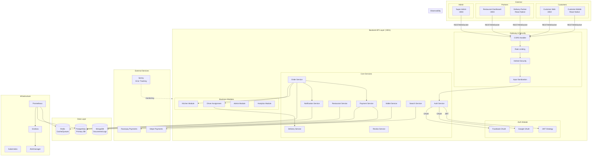

# System Architecture

```mermaid
graph TB
    subgraph External
        subgraph Customers
            CW[Customer Web<br/>:3002]
            CM[Customer Mobile<br/>React Native]
        end
        subgraph Partners
            RD[Restaurant Dashboard<br/>:3003]
            DP[Delivery Partner<br/>React Native]
        end
        subgraph Admin
            SA[Super Admin<br/>:3004]
        end
    end

    subgraph API["Backend API Layer (:3001)"]
        direction TB
        subgraph Gateway["Gateway & Security"]
            Cors[CORS Handler]
            Rate[Rate Limiting]
            Helmet[Helmet Security]
            Sanitize[Input Sanitization]
        end
        
        subgraph Auth["Auth Module"]
            JWT[JWT Strategy]
            Google[Google OAuth]
            Facebook[Facebook OAuth]
        end
        
        subgraph Services["Core Services"]
            AuthSvc[Auth Service]
            OrderSvc[Order Service]
            PaymentSvc[Payment Service]
            RestSvc[Restaurant Service]
            DelSvc[Delivery Service]
            NotifSvc[Notification Service]
            WallSvc[Wallet Service]
            SearchSvc[Search Service]
            ReviewSvc[Review Service]
        end
        
        subgraph Modules["Business Modules"]
            KitModule[Kitchen Module]
            DriverAssign[Driver Assignment]
            AdminMod[Admin Module]
            AnalyticsMod[Analytics Module]
        end
    end

    subgraph Data["Data Layer"]
        Postgres[(PostgreSQL<br/>Primary DB)]
        Mongo[(MongoDB<br/>Documents/Logs)]
        Redis[(Redis<br/>Cache/Queues)]
    end

    subgraph ExternalServices["External Services"]
        Stripe[Stripe Payments]
        Razorpay[Razorpay Payments]
        Sentry[Sentry<br/>Error Tracking]
    end

    subgraph Infra["Infrastructure"]
        K8s[Kubernetes]
        Prom[Prometheus]
        Graf[Grafana]
        Alert[Alertmanager]
    end

    CW -->|REST/WebSocket| Cors
    CM -->|REST/WebSocket| Cors
    RD -->|REST/WebSocket| Cors
    DP -->|REST/WebSocket| Cors
    SA -->|REST/WebSocket| Cors
    
    Cors --> Rate
    Rate --> Helmet
    Helmet --> Sanitize
    Sanitize --> AuthSvc
    
    AuthSvc -->|JWT| JWT
    AuthSvc -->|OAuth| Google
    AuthSvc -->|OAuth| Facebook
    
    OrderSvc --> PaymentSvc
    OrderSvc --> NotifSvc
    PaymentSvc --> Stripe
    PaymentSvc --> Razorpay
    OrderSvc --> Postgres
    RestSvc --> Postgres
    WallSvc --> Postgres
    SearchSvc --> Mongo
    
    NotifSvc --> Redis
    Prom --> Redis
    Prom --> Postgres
    
    subgraph Observability
        Prom --> Graf
        Graf --> Alert
    end
    
    OrderSvc --> KitModule
    OrderSvc --> DriverAssign
    DriverAssign --> DelSvc
    
    Sentry -.->|monitoring| API
```